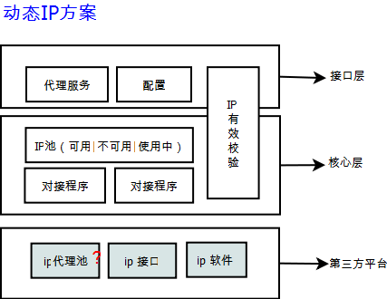

= ip 代理

== 建设目标
* 代理htt,https请求
* 同时对接多个第三方代理平台
* 支持集群部署
* 架构图

== 1.0.0目标
* 基本可用，支付get,post请求
* 支持图片请求
* 参数可配置
* https请求需要改为http
* 配置文件可修改

== TODOLIST
|===
| POST请求测试 |ok|
| 下载支持             |ok|
| 接入第二家代理 |doing|2016-04-20
| HA支持|ok|2016-04-26
| https支持|no|
| 配置文件提至包外|ok|2016-04-27
| 去除对jsoup的依赖|no|
|===

== 代理列表
* 蚂蚁代理
**   网址：http://www.mayidaili.com/dynamic
** 联系方式：qq群424699147
* 风云代理
**   网址：http://www.fengyunip.com/api/index.html
** 联系方式：

== 运行说明
java -Dprop.config=./resources/ -jar ipproxy-x.x.x-SNAPSHOT.jar 
配置文件位于：resources目录下。

link:./doc/配置说明.adoc[配置说明]
